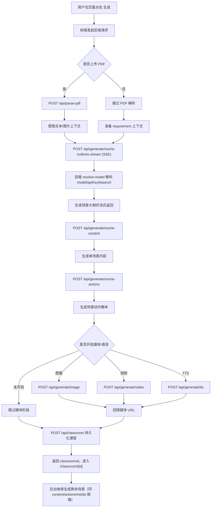

# 用户点击生成后的后端流程图

```mermaid
flowchart TD
    A["用户在页面点击 生成"] --> B["前端发起后端请求"]
    B --> C{"是否上传 PDF"}
    C -->|是| D["POST /api/parse-pdf"]
    C -->|否| E["跳过 PDF 解析"]
    D --> F["提取文本/图片上下文"]
    E --> G["准备 requirement 上下文"]
    F --> H["POST /api/generate/scene-outlines-stream (SSE)"]
    G --> H

    H --> I["后端 resolve-model 解析 model/apiKey/baseUrl"]
    I --> J["生成场景大纲并流式返回"]

    J --> K["POST /api/generate/scene-content"]
    K --> L["生成单场景内容"]
    L --> M["POST /api/generate/scene-actions"]
    M --> N["生成场景动作脚本"]

    N --> O{"是否开启媒体/语音"}
    O -->|图像| P["POST /api/generate/image"]
    O -->|视频| Q["POST /api/generate/video"]
    O -->|TTS| R["POST /api/generate/tts"]
    O -->|未开启| S["跳过媒体阶段"]

    P --> T["回填媒体 URL"]
    Q --> T
    R --> T
    S --> U["POST /api/classroom 持久化课堂"]

    T --> U
    U --> V["返回 classroomId，进入 /classroom/[id]"]
    V --> W["后台继续生成剩余场景（同 content/actions/media 链路）"]
```
